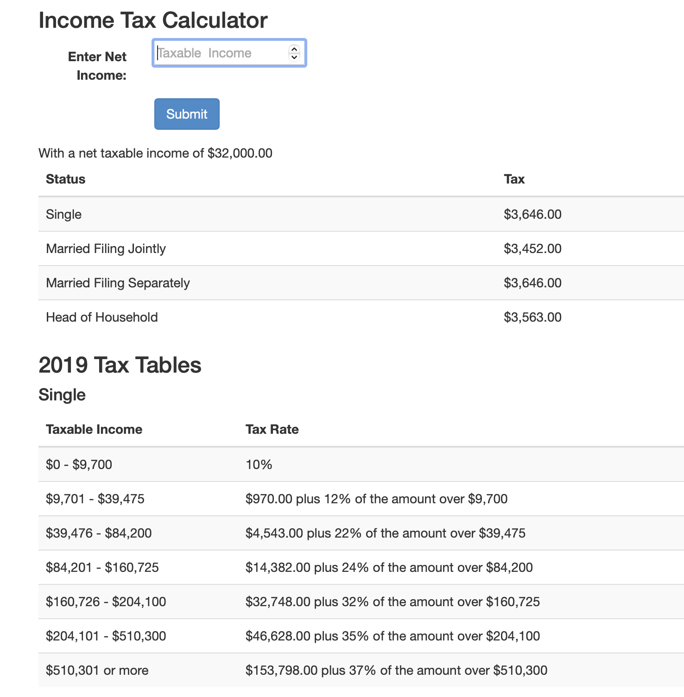

# Income Tax Calculator

*This project was an assignment for BU MET CS602: Server-Side Web Development. Copying any portion of it is strictly prohibited and is a violation of Boston University's Academic Conduct Code.*

## Technologies:
* PHP
* Bootstrap

that's it... I never said it was pretty :)

## Summary
The purpose of this project was to get comfortable with PHP and observe how using a 2D array of data can make the project code more elegant. In both versions, the user submits their annual income in a form and then views their yearly tax burden by filing status.

### Version 1
In Version1, the tax bracket data is not stored in a 2D array and thus the tax bracket boundaries are hard-coded into each function for Single, Married Filing Separately, Married Filing Jointly, or Head of Household status. As you can see, this creates a lot of cumbersome if-else statements and leads to lots of repeated code.

### Version 2
In Version2, the design is improved to store the data about minimum and maximum incomes for each tax bracket in a matrix. Rather than having a separate function for each filing status, the matrix allows us to loop over the matrix and locate the tax due with one function. Additionally, this version displays a table with all the tax tables.

## Screenshot

